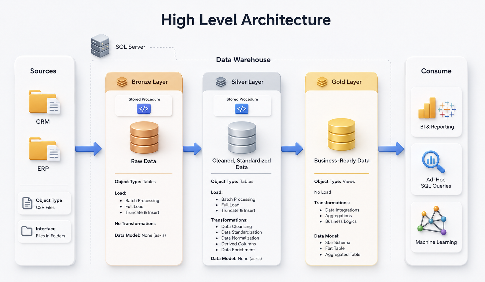
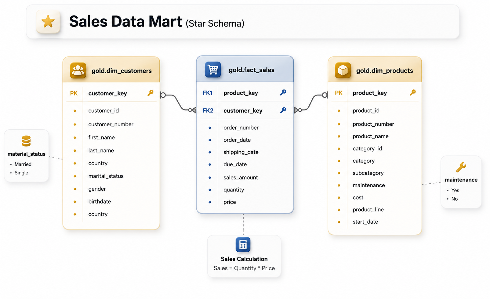
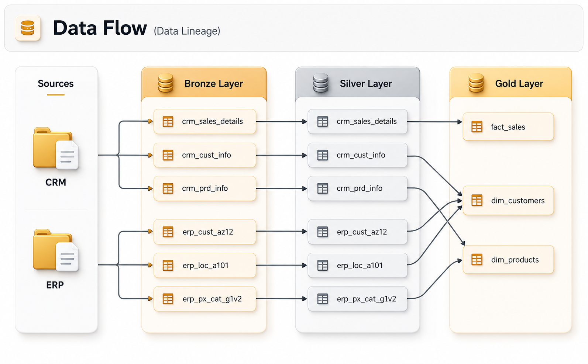

<div align="center">

# 🏗️ SQL Data Warehouse Project

### End-to-End Data Warehouse using PostgreSQL | ETL | Data Modeling | SQL Analytics | Power BI

</div>

---

## 📖 Overview

This project demonstrates the complete lifecycle of building a modern SQL Data Warehouse using PostgreSQL.

Starting from raw CSV files, the project transforms unstructured data into a clean analytical warehouse using a **Bronze → Silver → Gold** architecture. The warehouse is then used to generate business insights and Power BI dashboards.

This project is designed to showcase practical Data Analytics and Data Engineering skills commonly used in real-world business environments.

---

# 🚀 Project Architecture



---

# 🛠 Tech Stack

- PostgreSQL
- SQL
- ETL Pipeline
- Data Warehouse Modeling
- Views
- CTEs
- Window Functions
- Power BI
- Git & GitHub

---

# 📂 Project Structure

```
SQL-WareHouse-Project/

│
├── datasets/
│
├── bronze/
│   ├── create_tables.sql
│   ├── load_data.sql
│
├── silver/
│   ├── data_cleaning.sql
│   ├── transformations.sql
│
├── gold/
│   ├── business_views.sql
│   ├── analytics.sql
│
├── powerbi/
│
├── screenshots/
│
└── README.md
```

---

# 📊 Dataset

This project uses the **Brazilian E-Commerce Public Dataset by Olist**.

The dataset contains multiple related tables including:

- Customers
- Orders
- Order Items
- Payments
- Products
- Sellers
- Reviews
- Geolocation
- Category Translation

The relational nature of the dataset makes it ideal for Data Warehouse implementation.

---

# ⚙️ Data Warehouse Layers

## 🥉 Bronze Layer



---

## 🥈 Silver Layer

Cleans and standardizes the data.

Includes:

- NULL handling
- Data type corrections
- Duplicate removal
- Standardized values
- Quality checks


---

## 🥇 Gold Layer

Business-ready analytical models.

Contains:

- Fact tables
- Dimension tables
- Business views
- KPIs
- Reporting queries


---

# 📈 Business KPIs

The warehouse supports analysis such as:

- Total Revenue
- Total Orders
- Average Order Value
- Monthly Sales Trend
- Sales by Category
- Sales by State
- Customer Segmentation
- Payment Analysis
- Delivery Performance
- Top Selling Products
- Customer Lifetime Value
- Revenue Growth
- Year-over-Year Analysis

---

# 📊 Power BI Dashboard

The warehouse is connected to Power BI for interactive reporting.

Dashboard includes:

- Executive Summary
- Revenue Analysis
- Customer Insights
- Product Performance
- Geographic Sales
- Time Series Trends

---

# 🎯 SQL Concepts Demonstrated

- Joins
- CTEs
- Views
- Window Functions
- CASE Statements
- Aggregate Functions
- GROUP BY
- HAVING
- Date Functions
- Ranking Functions
- Common Business KPIs
- Warehouse Modeling

---

# 🚀 How to Run

1. Clone the repository

```bash
git clone https://github.com/aniket-dev-ai/SQL-WareHouse-Project.git
```

2. Create a PostgreSQL database.

3. Execute SQL scripts in the following order:

```
Bronze
↓
Silver
↓
Gold
```

4. Connect Power BI to PostgreSQL.

5. Build reports using the Gold layer.

---

# 📌 Learning Outcomes

This project demonstrates the ability to:

- Design a SQL Data Warehouse
- Build ETL pipelines
- Clean and transform raw data
- Develop analytical SQL queries
- Create business-ready datasets
- Design Power BI dashboards
- Apply dimensional modeling concepts

---

# 📸 Screenshots



- Database Schema
- ER Diagram
- Power BI Dashboard
- SQL Query Results

---

# ⭐ Future Improvements

- Incremental loading
- Stored Procedures
- Materialized Views
- Index Optimization
- Performance Tuning
- Automated ETL
- Data Validation Framework
- Docker Deployment

---

# 👨‍💻 Author

**Aniket Srivastava**

If you found this project helpful, consider giving it a ⭐ on GitHub.